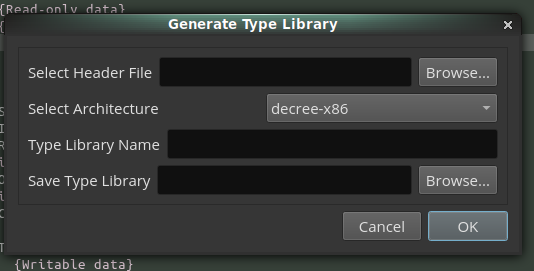
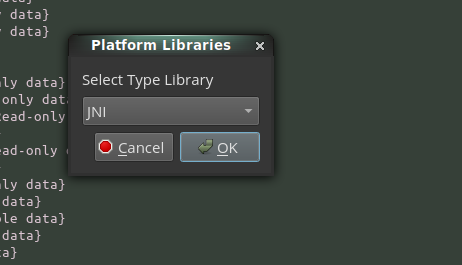

# Binary Ninja Type Manager

This plugin automatically loads user generated
[type libraries][binja-type-libraries] from the `~/.binaryninja.typelib`
directory.

## Usage

Type libraries generated for a platform can be added to the
`~/.binaryninja/typelib` directory.

```
➜ ls ~/.binaryninja/typelib/

decree-x86/       freebsd-thumb2/  linux-aarch64/  linux-mips/    linux-ppc32_le/  linux-thumb2/    linux-x86_64/  mac-thumb2/  windows-aarch64/  windows-x86/
freebsd-aarch64/  freebsd-x86/     linux-armv7/    linux-mipsel/  linux-ppc64/     linux-thumb2eb/  mac-aarch64/   mac-x86/     windows-armv7/    windows-x86_64/
freebsd-armv7/    freebsd-x86_64/  linux-armv7eb/  linux-ppc32/   linux-ppc64_le/  linux-x86/       mac-armv7/     mac-x86_64/  windows-thumb2/
```

To use a specific library when analyzing a binary, run the "Type Manager:
Load Type Library" command and select the type library to load:



A helper function to generate type libraries from C header files can be ran
with the "Type Manager: Generate Type Library" command.



When using this function, a standard header file most likely has to be tweaked
to appease the Binary Ninja parser. In particular, you will probably need to
manually process any pre-processor related items in the header file.

[binja-type-libraries]: https://binary.ninja/2019/09/30/1.2-launch.html#type-libraries
